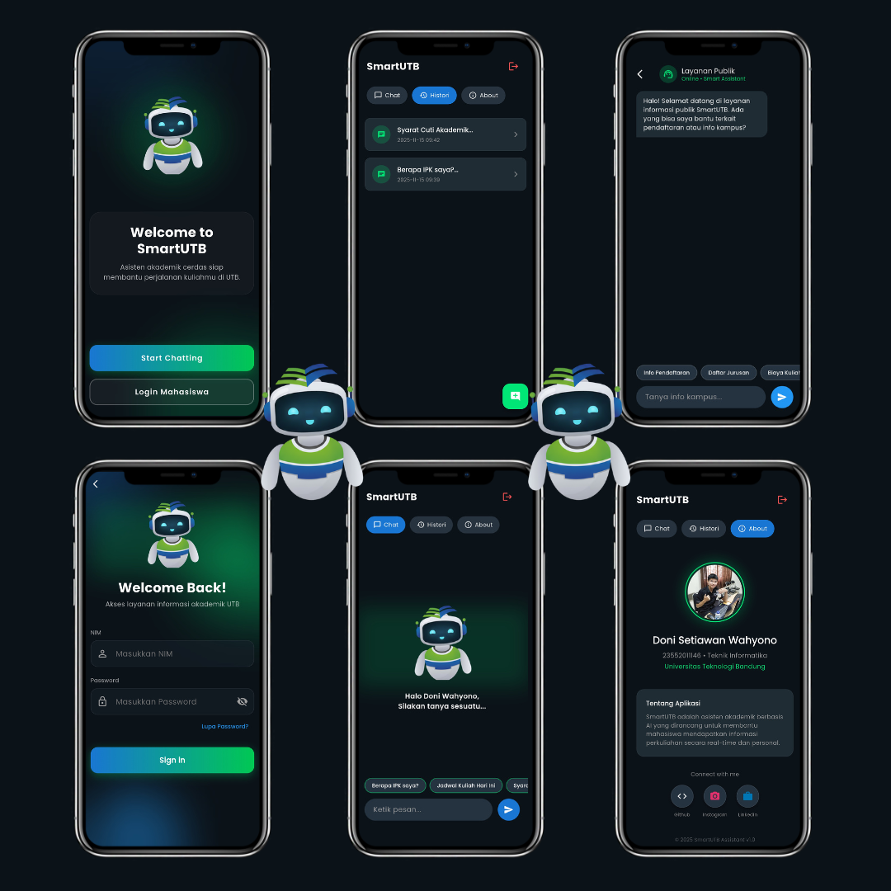

# SmartUTB Assistant 🎓🤖

  

**SmartUTB Assistant** adalah aplikasi mobile *Full Stack* yang berfungsi sebagai asisten akademik cerdas bagi mahasiswa Universitas Teknologi Bandung (UTB).

Aplikasi ini tidak hanya menjawab pertanyaan umum menggunakan *Fuzzy Logic*, tetapi juga terintegrasi dengan **Data Akademik Personal** untuk memberikan informasi spesifik seperti IPK, Jadwal Kuliah, dan Tagihan secara real-time.

---

## 🚀 Fitur Unggulan

### 1. Role-Based Access
* **Guest Mode:** Akses cepat untuk calon mahasiswa/tamu bertanya info umum (Pendaftaran, Jurusan, Biaya).
* **Student Mode:** Login aman menggunakan NIM & Password untuk akses data pribadi.

### 2. Personalized Academic AI
Chatbot mampu membaca database JSON akademik dan menjawab pertanyaan spesifik:
* *"Berapa IPK saya?"*
* *"Siapa dosen wali saya?"*
* *"Lihat jadwal kuliah hari Kamis"* (Filter pintar per hari)
* *"Cek tagihan semester ini"*

### 3. Smart Suggestions & Typo Tolerance
* **Suggestion Chips:** Tombol pertanyaan cepat agar pengguna tidak perlu mengetik.
* **Fuzzy Logic (Difflib):** Backend tetap mengerti pertanyaan meskipun pengguna salah ketik (*typo*), misal: *"byaya kulia"* tetap terdeteksi sebagai *"biaya kuliah"*.

### 4. Session History Management
* Menyimpan riwayat percakapan antar sesi.
* Mahasiswa dapat melihat kembali chat sebelumnya bahkan setelah aplikasi ditutup.

---

## 🛠️ Teknologi yang Digunakan

### Frontend (Mobile App)
Dibangun menggunakan **Flutter SDK**.
* **Architecture:** Modular (Separation of Logic & UI).
* **UI Kit:** Material 3, Google Fonts (Poppins), Custom Glassmorphism Widgets.
* **Networking:** `http` package untuk komunikasi REST API.

### Backend (Server API)
Dibangun menggunakan **Python Flask**.
* **Hosting:** PythonAnywhere (Online 24/7).
* **Database:** JSON Based Database (`users.json`, `data_academic.json`, `data_public.json`) - Ringan & Cepat.
* **Logic Library:** `difflib` (Pencocokan Teks), `flask_cors` (Keamanan Akses).

---

## 👤 Tentang Pengembang

Project ini dibuat dengan ❤️ oleh:

**Doni Setiawan Wahyono**  
* **Role:** Mobile Application Developer  
* **Kampus:** Universitas Teknologi Bandung  
* **NPM:** 23552011146  

  
  

